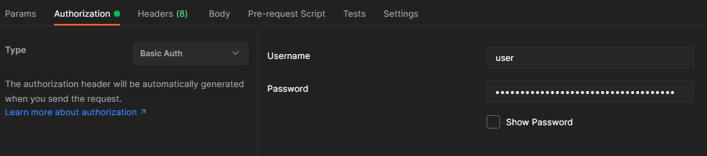

# spring-security-michelli-brito
https://www.youtube.com/watch?v=t6prPki7daU  

Projeto modelo github https://github.com/MichelliBrito/parking-control-api/tree/security#readme  

O username default do spring segurity é user, o password default é apresentado no console logo quando o projeto sobe.  
Using generated security password: xxxxxxxx......  

O tipo de autenticação default é basic auth.  
  

